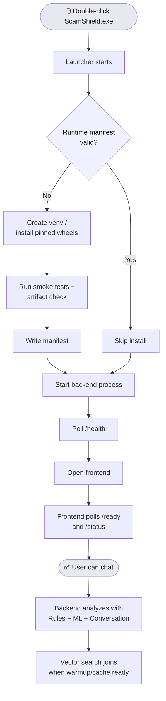

<div align="center">

# ScamShield


**Real-time scam interruption via layered inference.**  
Rules · Classifier · Semantic Search · LLM Reasoning

[]()
[]()
[]()
[]()

https://scamshieldai.vercel.app/ · [Architecture](#architecture) · [Validation](#validation)

</div>

---

## ⚡ One-Click Local Demo (Fastest Way to Test)

We've packaged the entire stack into a single RAR file for judges who want to
run the full local inference pipeline without any setup friction.

**Prerequisite — Python 3.11** (stable, required for dependency compatibility):

```bash
# Check your version first
python --version

# If not 3.11, install it (Windows — via winget)
winget install Python.Python.3.11

# macOS
brew install python@3.11

# Ubuntu / Debian
sudo apt install python3.11
```

**Then:**

1. Download and extract the RAR file from this repo
2. Open the extracted folder
3. Double-click **`scamshield.exe`** — it will install dependencies automatically
4. A browser window opens with the full ScamShield UI (same as the screenshots above)
5. Start typing or pasting a suspicious conversation — the full four-layer pipeline runs locally

No Render cold starts. No network dependency for layers 1–3. Full pipeline, on your machine.

> If Windows SmartScreen prompts a warning, click **More info → Run anyway**.
> The executable does nothing except bootstrap the local inference server and open your browser.

## How the Launcher Works


---

## The Problem

In 2025, India received 32.4 Million cyber fraud complaints. 2.2 Billion Dollars lost.
Digital arrest scams — where victims are held on continuous video calls by
impersonators of CBI, TRAI, or RBI — averaged 1,654.23 US Dollar per victim.

Awareness campaigns exist. They don't work at the moment of manipulation.
The intervention has to be real-time, on-device, and low-friction enough
for a 70-year-old to use in a panic.

---

## What We Built

ScamShield analyzes suspicious conversations — text, voice, or screenshots —
and returns a structured verdict in under 2 seconds: **SCAM**, **SUSPICIOUS**,
or **SAFE**, with the specific behavioral patterns that triggered it,
in the user's language, with a one-tap path to the national cyber helpline (1930).

The system is not a single model call. It is a four-layer inference pipeline
where the LLM is the last resort, not the first. This matters for three reasons:
latency (most cases resolve locally in under 10ms), privacy (conversation text
never leaves the device unless layers 1–3 are inconclusive), and resilience
(no single external dependency can take down core detection).

---

## Architecture

```
┌─────────────────────────────────────────────────────────────────┐
│  INPUT  (text / voice transcript / screenshot OCR)              │
└────────────────────────────┬────────────────────────────────────┘
                             │
                             ▼
┌─────────────────────────────────────────────────────────────────┐
│  LAYER 1 · Rules Engine                              🟢 LOCAL   │
│  60+ compiled regex patterns · Hinglish-aware · <10ms           │
│  Catches: call-retention pressure, OTP demands,                 │
│  fake FIR formats, digital arrest terminology                   │
└────────────────────────────┬────────────────────────────────────┘
                             │ inconclusive
                             ▼
┌─────────────────────────────────────────────────────────────────┐
│  LAYER 2 · ML Classifier                             🟢 LOCAL   │
│  TF-IDF + LogisticRegression · n-gram (1,3)                     │
│  STT noise correction · Hinglish normalization                  │
│  Trained on adversarial + synthetic corpus                      │
└────────────────────────────┬────────────────────────────────────┘
                             │ inconclusive
                             ▼
┌─────────────────────────────────────────────────────────────────┐
│  LAYER 3 · Semantic Vector Store                     🟢 LOCAL   │
│  Sentence-Transformers · cosine similarity                      │
│  500+ verified scam pattern library · RAG retrieval             │
│  Handles novel phrasing that rules and classifier miss          │
└────────────────────────────┬────────────────────────────────────┘
                             │ inconclusive
                             ▼
┌─────────────────────────────────────────────────────────────────┐
│  LAYER 4 · LLM Reasoning                          🌐 CLAUDE API │
│  Handles genuinely ambiguous / novel cases                      │
│  Invoked only when layers 1–3 return low-confidence verdicts    │
│  Deterministic fallback if API unavailable                      │
└────────────────────────────┬────────────────────────────────────┘
                             │
                             ▼
┌─────────────────────────────────────────────────────────────────┐
│  VERDICT · Structured verdict + Incident Report                 │
│  SCAM / SUSPICIOUS / SAFE · confidence · matched patterns       │
└─────────────────────────────────────────────────────────────────┘
```


**Design rationale**: Each layer is a gating function — not a retry. A case exits
the pipeline the moment a layer reaches threshold confidence. The result is that
the majority of clear-cut scam patterns never touch the network. Layer 4 (Claude)
handles only the genuinely ambiguous edge cases that deterministic methods cannot
resolve. This is a deliberate architectural boundary, not a cost optimisation.

**On network dependency**: Layers 1–3 are fully local. Layer 4 uses the Claude API.
Voice transcription uses a network-assisted STT service; the transcription layer
is a modular input adapter — the inference stack above it is independent of
how text arrives. A local STT engine (Whisper) can be substituted without
changing the detection logic.

---

## Validation

We built a closed-loop testing framework rather than relying on manual assessment.
Adversarial Test Harness — ScamShield v1
Verdict accuracy  : 74.0%  (54/73 cases)
False positive    : 1  (rate 3.1%)
False negative    : 0  (rate 0.0%)
Trend accuracy    : 90.4%
System health    : ✗ NEEDS WORK (<75% accuracy — review patches)

**On the 74% accuracy figure**: This is adversarial accuracy — evaluated against
synthetically hardened inputs designed to evade detection, not a representative
field sample. The metric we optimise first is false negative rate (0.0%): a missed
scam costs 1,654.23 US Dollar. A false alarm costs a two-minute verification call. That
asymmetry is baked into the scoring logic, not rationalized after the fact.
The improvement engine runs automatically on every failed case and generates
targeted patch candidates; accuracy compounds with each iteration.

### Test Infrastructure

| Component | What it does |
|---|---|
| `conversation_generator.py` | Generates adversarial synthetic conversations across 6 categories: STT noise, Hinglish, business fraud, romance scams, false positives, evolving tactics |
| `test_runner.py` | Runs all cases against the live API with retry logic and structured result capture |
| `evaluator.py` | Computes accuracy, FP/FN rates, trend accuracy, per-category breakdowns |
| `improvement_engine.py` | Analyzes failures and generates targeted rule patches and classifier retraining suggestions automatically |
| `run_history.json` | Tracks accuracy metrics across iterations — the system is measurably self-improving |

The improvement engine means we don't manually review failures — we generate
structured patch candidates and apply them. This is the loop that compounds.

---

## Failure Modes

We stress-tested the system against its own failure modes before submission.

| Failure | Behavior |
|---|---|
| Ambiguous verdict confidence | Always routes to **SUSPICIOUS** + 1930 referral. Never suppresses uncertainty. |
| False positive (real police call flagged) | UI states: "Verify by calling the official station number." Does not block action. |
| Layer 4 API unavailable | Falls back to Layer 3 verdict. Degraded but functional. All local layers remain operational. |
| Novel scam phrasing | Layer 3 semantic matching catches rephrased patterns. Layer 4 handles remainder. |
| STT transcription failure | Falls back to text input. Core inference stack unaffected. |

**Failure philosophy**: There is no single point of catastrophic failure. Each
layer degrades independently. A complete network outage leaves layers 1–3 intact,
covering the majority of field cases. Uncertainty is always surfaced — never
silently absorbed into a confident wrong verdict.

The asymmetry is intentional: a false alarm costs two minutes. A missed scam
costs ₹1,56,502. We weight the system accordingly.

---

## Output

ScamShield produces two artifacts per analysis:

**Verdict Card** — returned in under 2 seconds:
- SCAM / SUSPICIOUS / SAFE with confidence level
- 2–3 specific behavioral patterns that triggered the verdict, in plain language
- One-tap access to national cyber helpline: 1930
- Available in Hindi, English

**Incident Report** — generated on request:
- Caller number, transcript snippet, matched pattern, timestamp
- Formatted for filing at cybercrime.gov.in or sharing with family

---

## Next Engineering Milestones

These are scoped, not speculative:

1. **Local STT** — swap network-assisted transcription for Whisper Tiny; requires
   no changes to the inference stack; estimated 2–3 days of integration work
2. **Vision pipeline** — WhatsApp screenshot → OCR → analysis; Layer 1 already
   handles the text; input adapter needs building
3. **I4C database sync** — daily pull from the national scam pattern repository;
   feeds Layer 3 vector store; straightforward ETL work
4. **Backend deployment** — currently local; containerisation and cloud deployment
   is standard infrastructure work, not architecture work

---

## Setup

ScamShield runs in two modes. Local Full Inference is the real system.
The hosted demo exists for access convenience only — the inference architecture
is identical in both cases.

### Deployment Modes

| Mode | Description |
|---|---|
| **One-Click RAR (Fastest)** | Download the RAR, extract, run `scamshield.exe`. Requires Python 3.11. Full local pipeline, browser opens automatically. |
| **Local Full Inference** | Run frontend + backend manually. Full pipeline, no cold starts, conversation data stays on device through layers 1–3. |
| **Hosted Demo** | Frontend on Vercel, backend on Render free-tier. Functional for evaluation; expect cold-start latency on first request. |

---

### Hosted Demo

Live frontend: https://scamshieldai.vercel.app/

The public demo uses Vercel frontend hosting and a Render free-tier backend.
Because Render free-tier instances sleep when inactive, the first request may
take several seconds while the inference server wakes up.

The application handles this with backend wake-up detection, realtime loading
stages, graceful retry handling, and degraded-mode recovery states — the
interface never appears frozen.

**Note**: The hosted demo is a proof-of-access layer. It does not reflect
production latency. For accurate performance evaluation, run locally.

---

### Local Full Inference Mode

For accurate latency, full pipeline access, and on-device privacy:

```bash
# Backend — inference stack
pip install -r requirements.txt
uvicorn main:app --reload --port 8000
```

```bash
# Frontend
cd frontend && npm install && npm run dev
```

Switch the frontend API endpoint from the hosted URL to `http://localhost:8000`
in your environment config. The inference stack is otherwise identical.

---

### Additional Commands

```bash
# Run adversarial test suite
python run_tests.py

# Train / retrain classifier
python train_classifier.py

# Run improvement engine on failures
python run_tests.py --eval-only
```

---

<div align="center">

Built at **AIC × Anthropic Claude Hackathon, IIT Bombay** — May 2026  
Track: Governance & Collaboration

</div>
